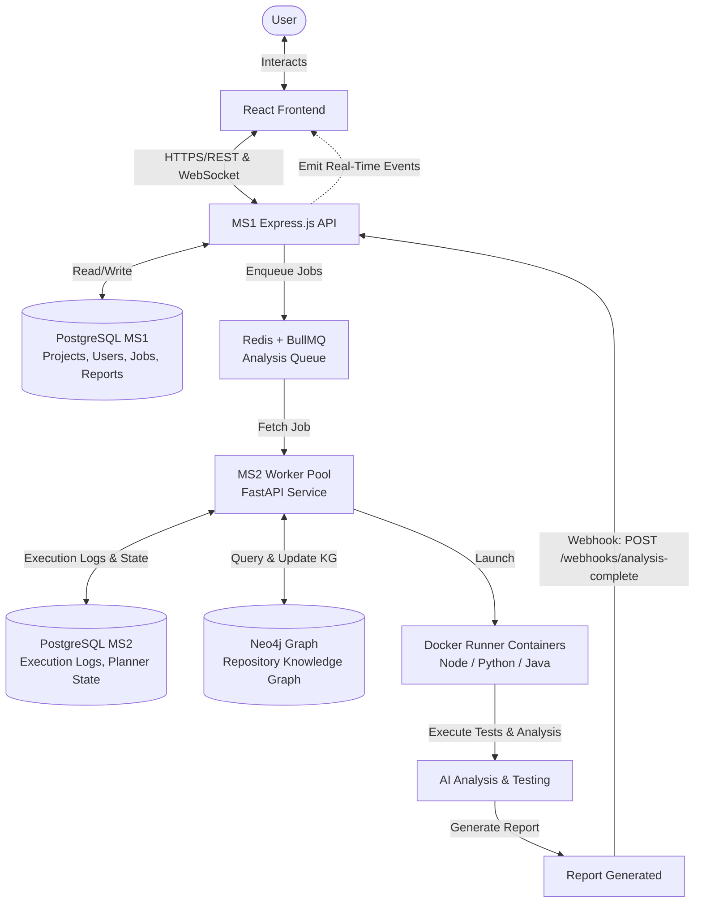
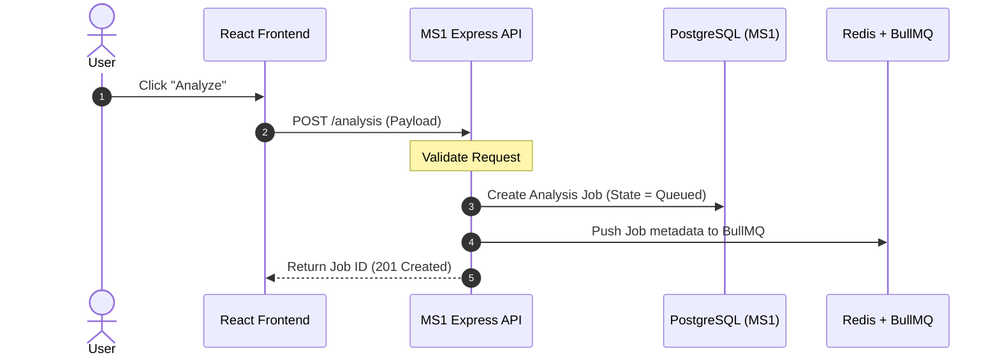
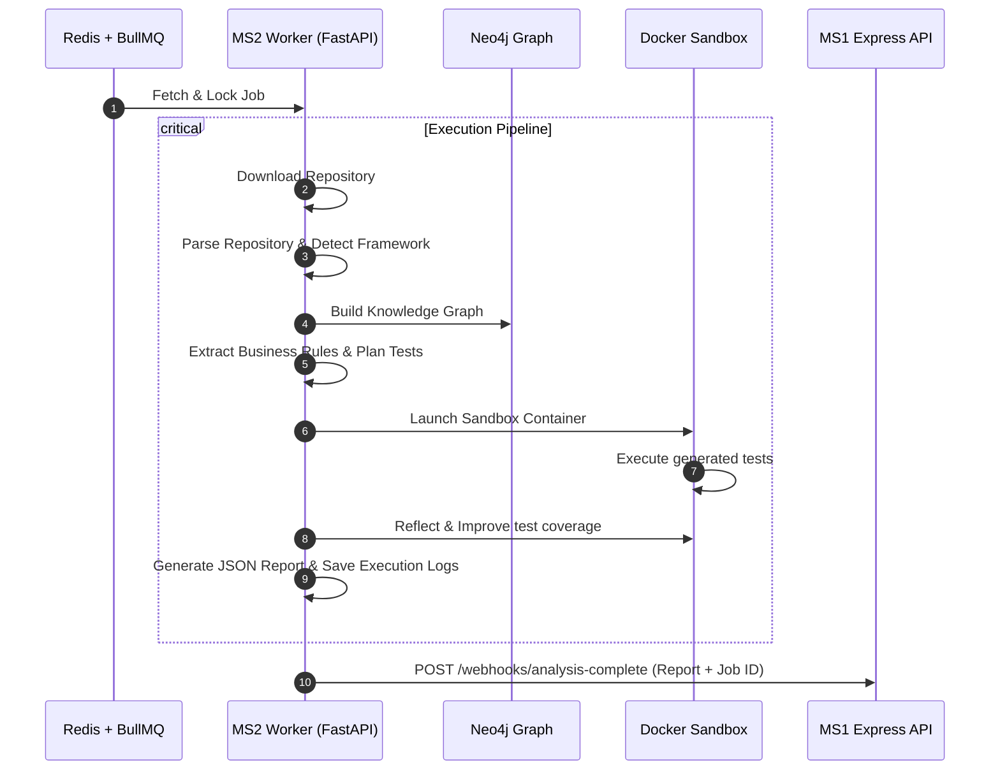
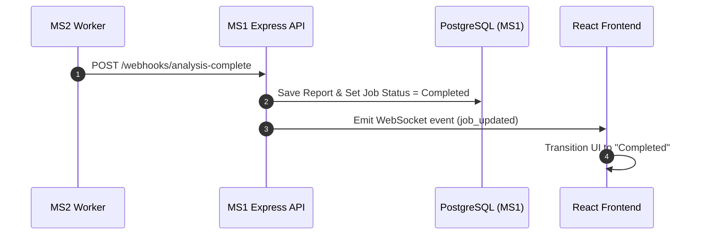
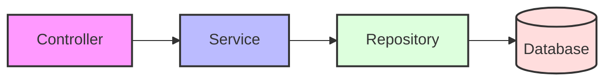

# System Architecture & Design Guidelines

This document serves as the single source of truth for the architecture, microservice boundaries, development workflows, and coding standards of the project. All engineers and AI agents must strictly follow these rules.

---

## 1. Microservice Boundaries

The system is split into two primary microservices, **MS1 (Core API)** and **MS2 (Worker Pool & AI Execution)**. Their responsibilities are strictly separated, and they must never share databases or bypass the queue.

### Service Ownership

#### MS1: Core API & Operations
- **Authentication**: JWT verification, user registration, sessions.
- **Projects**: Project creation, configuration, and settings management.
- **Repository Metadata**: Storage of repo links, owner names, configurations.
- **Jobs**: Job definitions, status tracking, queueing mechanisms.
- **Reports**: Persistence of generated reports and historical data.
- **Queue**: Producer side for job dispatch (BullMQ + Redis).
- **WebSockets**: Real-time progress updates to the React Frontend.

#### MS2: Agentic Worker Pool
- **Repository Parsing**: Clones, reads, and analyzes files.
- **AI Workflows**: Integrates LangGraph, LLM planners, and reflection loops.
- **Knowledge Graph**: Stores code semantics and structure in Neo4j.
- **Docker Execution**: Launches sandboxed runners for untrusted test executions.
- **Test Execution**: Generates, executes, and validates code-level test coverage.
- **Report Generation**: Formulates code health, security, and parsing reports.

> [!IMPORTANT]
> **Boundary Restrictions:**
> - Never move responsibilities between services.
> - Never allow MS1 to execute AI or testing logic directly.
> - Never allow MS2 to manage users, authentication, or serve frontend business APIs.
> - Databases are never shared across services (MS1 database vs. MS2 database).

---

## 2. System Architecture Diagram



---

## 3. End-to-End Workflows

### 3.1 Analysis Trigger & Queueing
1. **User clicks Analyze** in the React Frontend.
2. Frontend sends a **`POST /analysis`** request to MS1.
3. MS1 validates the request payload.
4. MS1 creates a new **Analysis Job** and stores its initial metadata in PostgreSQL (MS1).
5. MS1 pushes the job to the **Redis + BullMQ Queue**.
6. MS1 immediately returns the created **Job ID** back to the Frontend (non-blocking).



### 3.2 Queue Processing & Worker Execution
1. Workers in the **MS2 Worker Pool** constantly listen to the BullMQ Queue.
2. Worker #1 fetches the first pending job and locks it.
3. The Worker executes the analysis pipeline:
   - **Download**: Clones target git repository.
   - **Parse**: Runs static parser over files.
   - **Detect Framework**: Matches project dependencies and frameworks.
   - **Build KG**: Populates Neo4j Repository Knowledge Graph.
   - **Extract Rules**: Detects business constraints and logic patterns.
   - **Plan Tests**: AI generates a test plan for codebase coverage.
   - **Launch Docker**: Spins up a sandbox container matching the codebase environment.
   - **Execute Tests**: Runs tests inside the Docker sandbox.
   - **Reflect & Improve**: Iterates on failed assertions to maximize test coverage.
   - **Generate Report**: Compiles final output metrics and code health review.
   - **Save Logs**: Persists step-by-step logs to PostgreSQL (MS2).
4. The worker notifies MS1 of completion.



### 3.3 Completion & Notification
1. MS2 worker sends a `POST /webhooks/analysis-complete` request containing the final report.
2. MS1 processes the webhook:
   - Saves the final report data to PostgreSQL (MS1).
   - Updates the job status to `Completed` (or `Failed`).
3. MS1 emits a WebSocket event targeting the authenticated frontend client.
4. The React Frontend receives the WebSocket notification and updates the UI.
5. The User views the updated job report status on screen.



### 3.4 Frontend Lifecycle States
During execution, the frontend job status transitions through the following exact sequence:
$$\text{Queued} \rightarrow \text{Downloading Repository} \rightarrow \text{Parsing Repository} \rightarrow \text{Building Knowledge Graph} \rightarrow \text{Planning Tests} \rightarrow \text{Executing Tests} \rightarrow \text{Reflection} \rightarrow \text{Generating Report} \rightarrow \text{Completed}$$

---

## 4. Coding & Architecture Rules

### 4.1 General Principles
1. **Never over-engineer**: Keep code simple and straightforward.
2. **Single Responsibility (SRP)**: Every file and every function must solve exactly *one* problem.
3. **No Dead Code**: Never write code that "might be useful later."
4. **Phased Development**: Build only what is approved for the current phase.
5. **Readability first**: Clear, simple, and self-documenting code over complex optimizations.
6. **Reuse Logic**: Never duplicate business logic. Search before coding.
7. **No Duplications**: Never create multiple utilities performing the same tasks.

### 4.2 Code Size Limits
- **Maximum Controller**: 150 lines
- **Maximum Service**: 250 lines
- **Maximum Utility**: 100 lines
- **Maximum Function**: 40 lines
- *If any limit is exceeded, refactor immediately.*

### 4.3 Directory & File Naming
- Folders must be organized **by feature** (colocated endpoints, controllers, services, and schemas) rather than by type, unless absolutely necessary.
- Deep nesting of folders is strictly discouraged.
- Filenames must describe exactly what they contain. Never use generic files (e.g., `utils.ts`, `helper.ts`, `misc.ts`, `common.ts`).

**Good File Naming Conventions:**
- `auth.controller.ts`
- `auth.service.ts`
- `jwt.middleware.ts`
- `repository.routes.ts`
- `analysis.queue.ts`
- `websocket.gateway.ts`

**Example Feature Structure:**
```text
auth/
    auth.routes.ts
    auth.controller.ts
    auth.service.ts
    auth.validation.ts
```

### 4.4 Clean Architecture Flow
Dependencies must always flow in one direction:
$$\text{Controller} \rightarrow \text{Service} \rightarrow \text{Repository} \rightarrow \text{Database}$$



#### Layer Restrictions
- **Controllers**:
  - Must not exceed 30 lines per endpoint function.
  - Do not write business logic, database queries, or request validation directly inside controller functions.
  - Pattern: `Request` $\rightarrow$ `Validation` $\rightarrow$ `Service Call` $\rightarrow$ `Response`.
- **Services**:
  - Houses all business logic.
  - Cohesive, testable, and reusable.
- **Repositories**:
  - Only execute CRUD operations on the database.
  - Never call external APIs, check validations, or implement business logic.

---

## 5. API Design & REST Naming Standards
Use **noun-based REST patterns** only. Do not embed verbs in URI paths.
- **Correct**:
  - `POST /projects`
  - `GET /projects`
  - `GET /projects/:id`
  - `PATCH /projects/:id`
  - `DELETE /projects/:id`
- **Incorrect**:
  - `/createProject`
  - `/getProjects`
  - `/doAnalysis`

---

## 6. Centralized Systems

### 6.1 Error Handling
- Never duplicate try/catch blocks across controllers.
- Use a global exception filter or error-handling middleware.
- Return standard, structured JSON error payloads (e.g., status, message, timestamp, error code).

### 6.2 Logging
- Do not use `console.log()` or basic `print()` statements.
- Use centralized logging abstractions (e.g., Winston, Morgan, or structured JSON logger).
- Log warnings, errors, and important lifecycle states (such as application boots, job completions, etc.).

### 6.3 Comments
- Write self-explanatory code.
- Avoid descriptive comments explaining *what* the code does. Only comment to explain *why* a particular decision or work-around was made.

---

## 7. Phased Development Lifecycle
For every phase of work, you must structure communications around the following milestones:

### Start of Phase
Always output the following format and wait for user approval:
```text
Phase Number: [Number]
Objective: [Short Summary]
Files to Create: [Paths]
Files to Modify: [Paths]
API Changes: [List of routes]
Database Changes: [Schema/Migration detail]
Risks: [Identification of risks]
Estimated Complexity: [Low/Medium/High]
```
> [!WARNING]
> Do not generate any codebase file or run execution commands until explicit phase approval is received from the user.

### End of Phase
Provide a summary containing:
- $\checkmark$ Files Created
- $\checkmark$ Files Modified
- $\checkmark$ Endpoints Added
- $\checkmark$ Database Changes
- $\checkmark$ Reusable Components
- $\checkmark$ Testing Steps
- $\checkmark$ Next Recommended Phase
Wait for next instructions.


## Documentation Update Policy (Mandatory)

After every successfully completed and approved phase, the AI MUST update the project documentation before stopping.

Documentation is considered part of the implementation.

A phase is NOT complete until all documentation has been updated.

Do not skip documentation.

Never leave documentation outdated.

Files to Update After Every Phase
docs/
│
├── current-phase.md          ← Current project status
├── changelog.md              ← What changed in this phase
├── architecture.md           ← Update only if architecture changes
├── api/
│     └── api-reference.md
├── workflows/
│     └── workflow-reference.md
├── services/
│     ├── ms1.md
│     ├── ms2.md
│     └── frontend.md
├── queue/
│     └── queue-flow.md
└── file-index.md             ← Complete project file index