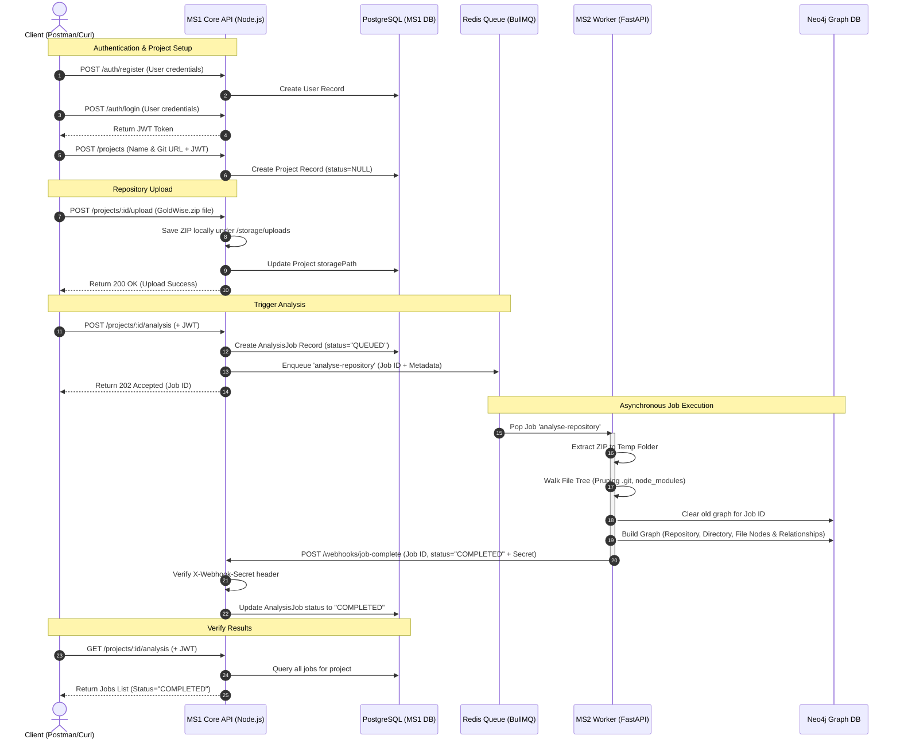

# Repository Intelligence System Flow & Test Guide

This document provides a detailed, step-by-step breakdown of how the **Repository Intelligence System** works, its architectural data flow, the APIs involved, and how to verify and test the system.

---

## 1. System Architecture Overview

The system is built as a microservices architecture consisting of:
1. **MS1 (Core API - Node.js/TypeScript)**: Handles user onboarding, project management, file upload storage, and queuing parsing jobs. It uses **PostgreSQL** (via Prisma) to track database records.
2. **Redis (BullMQ)**: Serves as the message queue broker. MS1 publishes jobs to the queue, and MS2 consumes them.
3. **MS2 (Worker - FastAPI/Python)**: Consumes parsing jobs, extracts repository zip archives, walks the directory tree, filters files, maps relationships, builds the **Neo4j** knowledge graph, and sends webhooks.
4. **Neo4j**: Graph database used to persist the structural relationship of the repository: `Repository` -> `Directory` -> `File`.

---

## 2. End-to-End Execution Flow

Below is the sequence diagram illustrating how all components interact during a complete run:



---

## 3. API Reference

All requests to MS1 business endpoints (Projects and Analysis) require a valid bearer JWT token passed via the `Authorization` header: `Authorization: Bearer <TOKEN>`.

| Microservice | Method | Route | Auth | Request Body | Response Success | Purpose |
| :--- | :--- | :--- | :--- | :--- | :--- | :--- |
| **MS1** | `POST` | `/auth/register` | Public | `{"email", "password"}` | `201 Created` | Create a new user account |
| **MS1** | `POST` | `/auth/login` | Public | `{"email", "password"}` | `200 OK` (returns JWT `token`) | Log in and receive JWT token |
| **MS1** | `POST` | `/projects` | Required | `{"name", "repoUrl"}` | `201 Created` (returns `project`) | Create a new project record |
| **MS1** | `POST` | `/projects/:id/upload` | Required | Multipart Form Data (`file` field) | `200 OK` (returns updated `project`) | Upload repository ZIP file |
| **MS1** | `POST` | `/projects/:id/analysis` | Required | None | `202 Accepted` (returns `job`) | Create job & push to queue |
| **MS1** | `GET` | `/projects/:id/analysis` | Required | None | `200 OK` (returns list of `jobs`) | Check job status in database |
| **MS1** | `POST` | `/webhooks/job-complete` | Internal | `{"jobId", "status", "error"}` | `200 OK` (returns updated `job`) | Webhook callback to update status |

---

## 4. How to Test the System End-to-End

Follow these steps using a terminal (with `curl.exe`) or a Desktop API Client (like the **Postman Desktop App**). 

> [!IMPORTANT]
> If testing via Postman, do **NOT** use the Postman Web version in your browser, as it enforces a strict 5MB upload limit. Use the Desktop client instead, or run the terminal `curl` commands below.

### Step 1: User Registration
```powershell
curl.exe -X POST http://localhost:3000/auth/register `
  -H "Content-Type: application/json" `
  -d "{\"email\": \"developer@example.com\", \"password\": \"securePassword123!\"}"
```
*Copy the user details. Next, log in.*

### Step 2: Log In & Get Token
```powershell
curl.exe -X POST http://localhost:3000/auth/login `
  -H "Content-Type: application/json" `
  -d "{\"email\": \"developer@example.com\", \"password\": \"securePassword123!\"}"
```
*Copy the JWT `"token"` from the response. You will use this token as `<TOKEN>` in all subsequent requests.*

### Step 3: Create a Project
Create a project representing the repository you want to analyze:
```powershell
curl.exe -X POST http://localhost:3000/projects `
  -H "Authorization: Bearer <TOKEN>" `
  -H "Content-Type: application/json" `
  -d "{\"name\": \"GoldWise App\", \"repoUrl\": \"https://github.com/vansh700/goldwise\"}"
```
*Copy the `"id"` from the response. This is your `<PROJECT_ID>`.*

### Step 4: Upload the Repository ZIP File (up to 100MB)
Upload your repository `.zip` archive (e.g., `GoldWise.zip` from your Desktop) to MS1:
```powershell
curl.exe -X POST http://localhost:3000/projects/<PROJECT_ID>/upload `
  -H "Authorization: Bearer <TOKEN>" `
  -F "file=@C:\Users\Vansh\OneDrive\Desktop\zip-fles\GoldWise.zip"
```
*This uploads the archive. The server will store it locally on disk.*

### Step 5: Trigger Repository Analysis
Start the asynchronous analysis. This will register a job in the database with status `QUEUED` and push it to Redis:
```powershell
curl.exe -X POST http://localhost:3000/projects/<PROJECT_ID>/analysis `
  -H "Authorization: Bearer <TOKEN>"
```
*Copy the `"id"` from the response. This is your `<JOB_ID>`.*

### Step 6: Verify the Job Status in PostgreSQL
Poll the status of the job in PostgreSQL. It will transition from `QUEUED` to `COMPLETED` once MS2 finishes parsing:
```powershell
curl.exe -X GET http://localhost:3000/projects/<PROJECT_ID>/analysis `
  -H "Authorization: Bearer <TOKEN>"
```
*Wait a few seconds. The status should update to `"COMPLETED"`.*

---

## 5. Verifying the Results in Neo4j

Once the job is completed, you can check that the file tree is fully populated in Neo4j:

1. Open your browser and navigate to: **`http://localhost:7474`**
2. Connect using:
   * **Username**: `neo4j`
   * **Password**: `neo4j_password`
3. Run the following Cypher query to count the imported nodes:
   ```cypher
   MATCH (n) RETURN labels(n)[0] AS NodeType, count(n) AS TotalNodes
   ```
4. Run this query to visualize the hierarchical structure (directories branching into subfolders and files):
   ```cypher
   MATCH path = (r:Repository {jobId: "YOUR_JOB_ID"})-[*1..3]->(n) 
   RETURN path LIMIT 250
   ```

*Note: Large repositories containing thousands of files inside `.git` or `node_modules` folders will have those specific folders ignored by design during ingestion to focus solely on user source files.*
